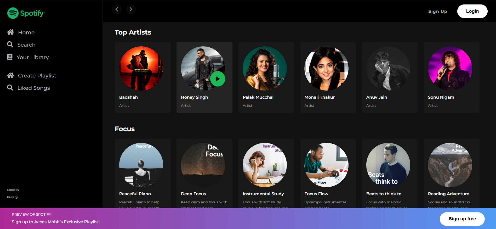

<!DOCTYPE html>
<html lang="en">

<head>
    <meta charset="UTF-8">
    <meta name="viewport" content="width=device-width, initial-scale=1.0">
</head>

<body>
    <h1>Spotify Clone</h1>
    
This project is a simple Spotify clone webpage created using HTML and CSS. It aims to mimic the basic functionality and layout of the Spotify web application.

    <h2>Features</h2>
    <ul>
        <li>Responsive design for various screen sizes.</li>
        <li>Sidebar navigation with Home, Search, and Your Library sections.</li>
        <li>Ability to create playlists and access liked songs.</li>
        <li>Display of top artists and curated playlists.</li>
        <li>Preview of Spotify's features and a call-to-action to sign up for free.</li>
    </ul>
    <h2>Technologies Used</h2>
    <ul>
        <li>HTML5</li>
        <li>CSS3</li>
        <li>Font Awesome for icons</li>
    </ul>
    <h2>Preview</h2>
    
    <h2>How to Use</h2>
    <ol>
        <li>Clone the repository:</li>
    </ol>
    
<code>git clone https://github.com/your-username/spotify-clone.git</code>

    <ol start="2">
        <li>Open the <code>index.html</code> file in your web browser.</li>
    </ol>
    <h2>Credits</h2>
    
Images used in the project are for demonstration purposes only and are sourced from various online platforms.

    <h2>License</h2>
    
This project is licensed under the MIT License - see the <a href="LICENSE">LICENSE</a> file for details.

</body>

</html>
